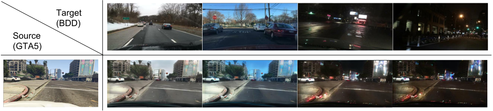
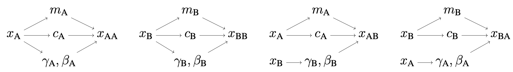

# Exemplar Guided Unsupervised Image-to-Image
Tensorflow implementation of NIPS 2018 submission [Exemplar Guided Unsupervised Image-to-Image](https://arxiv.org/abs/1805.11145)

## Network architecture

## Dependencies
- python 2.7
- tensorflow-gpu (1.4.1)
- numpy (1.14.0)
- Pillow (5.0.0)
- scikit-image (0.13.0)
- scipy (1.0.1)
- matplotlib (2.0.0)

## Resources
- Pretrained models: 
- Training & Testing data in tf-record format: [MNIST](http://homes.esat.kuleuven.be/~liqianma/NIPS18_EGUNIT/data/mnist_tf.zip), [Celeba](http://homes.esat.kuleuven.be/~liqianma/NIPS18_EGUNIT/data/celeba_tf.zip), [GTA<->Cityscapes](http://homes.esat.kuleuven.be/~liqianma/NIPS18_EGUNIT/data/gta_city_tf.zip). [GTA<->BDD](http://homes.esat.kuleuven.be/~liqianma/NIPS18_EGUNIT/data/gta_bdd_tf.zip).

## Segmentation model 
Refer to [DeepLab-ResNet-TensorFlow](https://github.com/DrSleep/tensorflow-deeplab-resnet)

